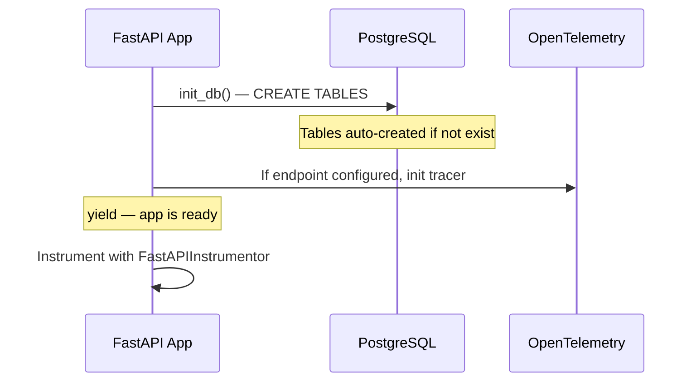
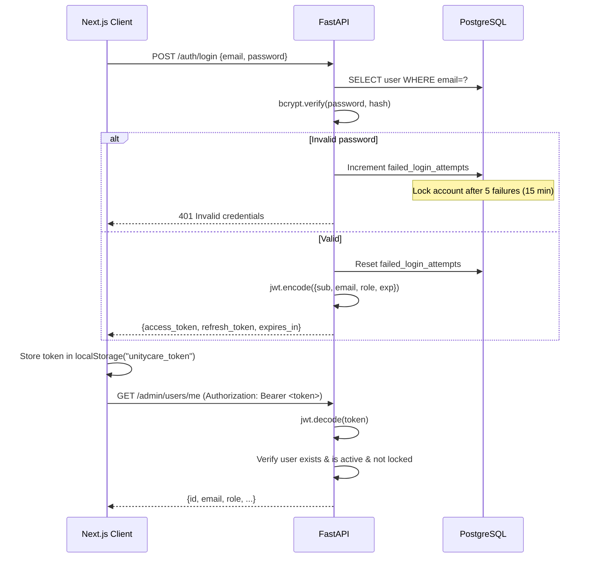
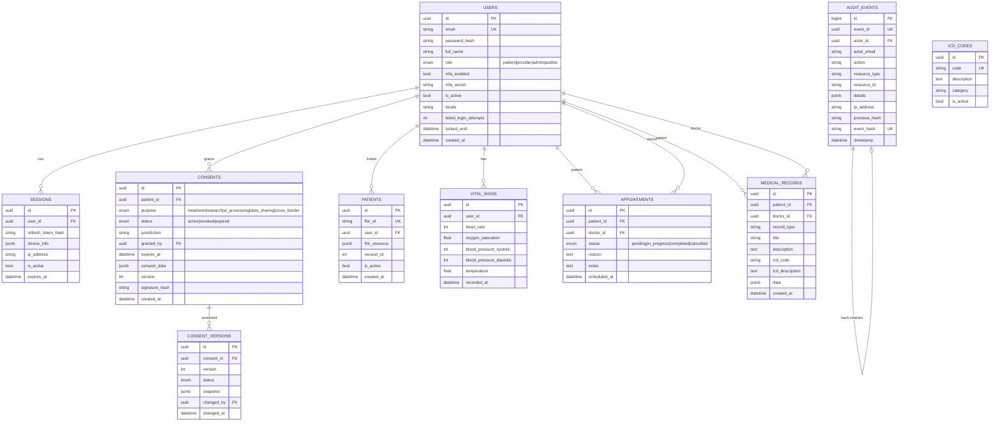
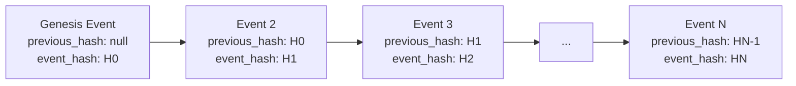
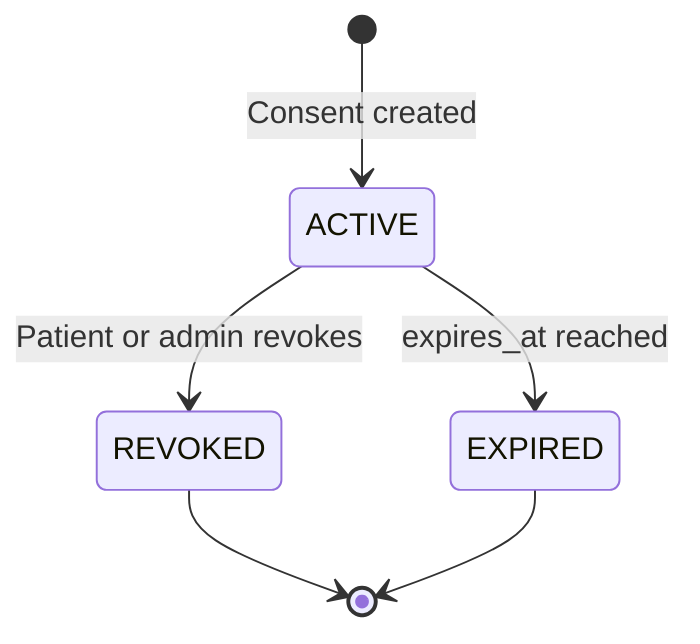
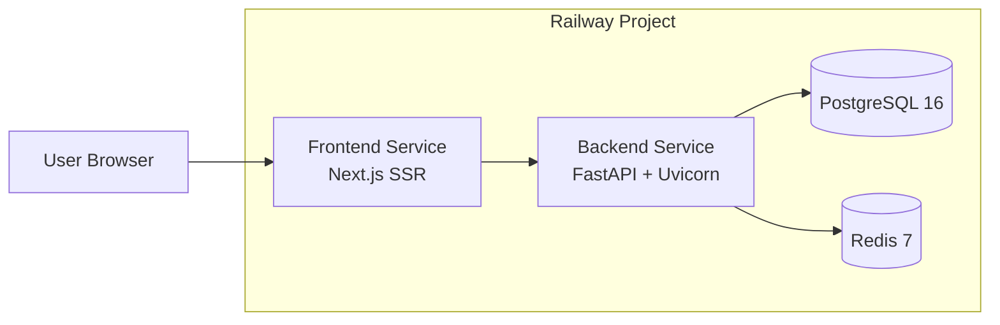
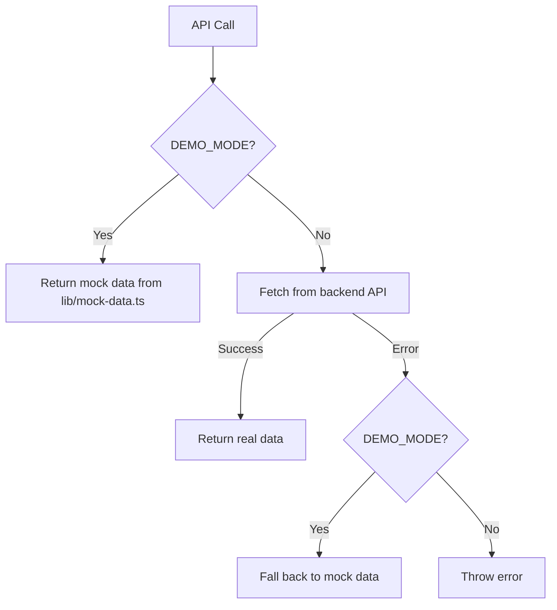

# UnityCare — Healthcare Trust Infrastructure Architecture

> **Document Version:** 1.0  
> **Status:** Procurement-Grade · MVP  
> **Organization:** Elmahrosa International  
> **Repository:** `github.com/Elmahrosa/UnityCare`

---

## 1. System Overview

UnityCare is a sovereign healthcare infrastructure platform providing identity, consent, interoperability, and audit capabilities for regulated healthcare markets. The system follows a **three-tier architecture** with a stateless Next.js frontend, a layered FastAPI backend, and PostgreSQL for persistence.

```
┌─────────────────────────────────────────────────────────────────┐
│                        CLIENT LAYER                             │
│                                                                 │
│  ┌──────────┐  ┌──────────┐  ┌──────────┐  ┌──────────┐       │
│  │ Landing  │  │  Login   │  │ Register │  │ Dash-    │       │
│  │ Page     │  │  Page    │  │  Page    │  │ boards   │       │
│  └──────────┘  └──────────┘  └──────────┘  └──────────┘       │
│         Next.js 15 App Router · React 19 · Tailwind CSS        │
│         TypeScript 5.7 · i18n (en/ar) · Demo Mode Fallback     │
└──────────────────────────┬──────────────────────────────────────┘
                           │ HTTP / REST
                           ▼
┌─────────────────────────────────────────────────────────────────┐
│                       API GATEWAY LAYER                         │
│                                                                 │
│              FastAPI · Uvicorn · CORS · Rate Limit              │
│              Security Headers · JWT HTTPBearer                  │
│              OpenTelemetry (optional)                           │
│                                                                 │
│  ┌──────────┐  ┌──────────┐  ┌──────────┐  ┌──────────┐       │
│  │ /api/v1/ │  │ /api/v1/ │  │ /api/v1/ │  │ /api/v1/ │       │
│  │ auth     │  │ fhir/    │  │ consent  │  │ audit    │       │
│  │          │  │ Patient  │  │          │  │          │       │
│  └──────────┘  └──────────┘  └──────────┘  └──────────┘       │
│  ┌──────────┐  ┌──────────┐  ┌──────────┐  ┌──────────┐       │
│  │ /api/v1/ │  │ /api/v1/ │  │ /health  │  │ /status  │       │
│  │ medical  │  │ admin    │  │          │  │          │       │
│  └──────────┘  └──────────┘  └──────────┘  └──────────┘       │
└──────────────────────────┬──────────────────────────────────────┘
                           │ Service Layer
                           ▼
┌─────────────────────────────────────────────────────────────────┐
│                      SERVICE LAYER                              │
│                                                                 │
│  ┌──────────┐  ┌──────────┐  ┌──────────┐  ┌──────────┐       │
│  │ Auth     │  │ FHIR     │  │ Consent  │  │ Medical  │       │
│  │ Service  │  │ Service  │  │ Service  │  │ Service  │       │
│  └──────────┘  └──────────┘  └──────────┘  └──────────┘       │
│  ┌──────────┐                                                    │
│  │ Audit    │  ← used by all services                           │
│  │ Service  │                                                    │
│  └──────────┘                                                    │
│  Services receive AsyncSession via constructor injection        │
└──────────────────────────┬──────────────────────────────────────┘
                           │ SQLAlchemy 2.0 Async
                           ▼
┌─────────────────────────────────────────────────────────────────┐
│                      DATA LAYER                                 │
│                                                                 │
│  PostgreSQL 16 · asyncpg · SQLAlchemy 2.0 ORM                   │
│  JSONB for FHIR resources · UUID PKs · Auto-migrate via init_db │
│                                                                 │
│  ┌──────────┐  ┌──────────┐  ┌──────────┐  ┌──────────┐       │
│  │ users    │  │ patients │  │ consents │  │ audit_   │       │
│  │          │  │          │  │          │  │ events   │       │
│  └──────────┘  └──────────┘  └──────────┘  └──────────┘       │
│  ┌──────────┐  ┌──────────┐  ┌──────────┐  ┌──────────┐       │
│  │ vitals   │  │ appoint- │  │ medical_ │  │ icd_     │       │
│  │          │  │ ments    │  │ records  │  │ codes    │       │
│  └──────────┘  └──────────┘  └──────────┘  └──────────┘       │
│  ┌──────────┐  ┌──────────┐                                     │
│  │ consent_ │  │ sessions │                                     │
│  │ versions │  │          │                                     │
│  └──────────┘  └──────────┘                                     │
└─────────────────────────────────────────────────────────────────┘
```

---

## 2. Technology Stack

| Category              | Technology                          | Version     |
|-----------------------|-------------------------------------|-------------|
| **Frontend Framework**| Next.js (App Router)                | ^15.1.0     |
| **UI Library**        | React                               | ^19.0.0     |
| **Styling**           | Tailwind CSS                        | ^3.4.16     |
| **Language**          | TypeScript                          | ^5.7.0      |
| **Backend Framework** | FastAPI                             | 0.115.6     |
| **Python**            | CPython                             | 3.12        |
| **ORM**               | SQLAlchemy (async)                  | 2.0.36      |
| **DB Driver**         | asyncpg                             | 0.30.0      |
| **Database**          | PostgreSQL                          | 16-alpine   |
| **Cache**             | Redis                               | 7-alpine    |
| **Auth**              | python-jose (JWT) + bcrypt          | 3.4.0/4.2.1 |
| **Validation**        | Pydantic                            | 2.10.3      |
| **Config**            | Pydantic Settings                   | 2.7.0       |
| **API Client (FE)**   | fetch (native)                      | —           |
| **Testing (FE)**      | Jest + ts-jest + @testing-library   | 29.x        |
| **Monitoring (opt.)** | OpenTelemetry SDK/Exporter/Instr.   | 1.29.0      |
| **Migrations (opt.)** | Alembic                             | 1.14.0      |
| **Deployment**        | Railway (Docker)                    | —           |
| **Containerization**  | Docker / Docker Compose             | —           |

---

## 3. Directory Structure

```
UnityCare-Platform/
├── ARCHITECTURE.md                # This document
├── AGENTS.md                      # Session context for AI coding
├── docker-compose.yml             # Local dev orchestration (Postgres + Redis + Backend + Frontend)
│
├── backend/
│   ├── Dockerfile                 # Python 3.12-slim container
│   ├── railway.toml               # Railway deployment config
│   ├── requirements.txt           # Python dependencies
│   ├── start.sh                   # Uvicorn entrypoint
│   └── app/
│       ├── __init__.py
│       ├── main.py                # FastAPI app factory, lifespan, middleware, routers
│       ├── config.py              # Pydantic Settings (env-based)
│       ├── database.py            # async engine, session factory, init_db()
│       ├── models/                # SQLAlchemy ORM models
│       │   ├── user.py            # User, Role, Session
│       │   ├── patient.py         # Patient (FHIR resource blob)
│       │   ├── medical.py         # VitalSigns, Appointment, MedicalRecord, IcdCode
│       │   ├── consent.py         # Consent, ConsentVersion, ConsentPurpose
│       │   └── audit.py           # AuditEvent (hash-chained)
│       ├── schemas/               # Pydantic request/response models
│       │   ├── user.py
│       │   ├── patient.py
│       │   ├── medical.py
│       │   └── consent.py
│       ├── services/              # Business logic layer
│       │   ├── auth.py            # Registration, authentication, token creation
│       │   ├── fhir.py            # FHIR Patient CRUD
│       │   ├── medical.py         # Vitals, appointments, records, ICD-10
│       │   ├── consent.py         # Purpose-based consent lifecycle
│       │   └── audit.py           # Hash-chained audit logging + verification
│       ├── api/
│       │   └── v1/                # Versioned API routers
│       │       ├── auth.py        # POST /auth/register, /auth/login
│       │       ├── patients.py    # CRUD /fhir/Patient
│       │       ├── medical.py     # /iot/{id}/vitals, /appointments, /records, /icd-codes
│       │       ├── consents.py    # CRUD /consent
│       │       ├── audit.py       # GET /audit/events, /audit/verify
│       │       └── admin.py       # GET/PATCH /admin/users
│       ├── middleware/
│       │   ├── auth.py            # JWT HTTPBearer, get_current_user, require_role
│       │   ├── rate_limit.py      # In-memory sliding window rate limiter
│       │   └── security_headers.py # HSTS, CSP, XFO, etc.
│       └── utils/
│           ├── hashing.py         # SHA-256 event/consent hash computation
│           └── security.py        # bcrypt hash_password / verify_password
│
├── frontend/
│   ├── Dockerfile                 # Node.js 20-alpine, Next.js standalone
│   ├── railway.toml               # Railway deployment config
│   ├── package.json
│   ├── tsconfig.json
│   ├── next.config.js
│   ├── tailwind.config.ts
│   ├── jest.config.js             # Jest configuration
│   ├── jest.setup.js              # Testing library setup
│   ├── __tests__/                 # Frontend test suites
│   │   ├── login.test.tsx
│   │   └── patient.test.tsx
│   ├── app/
│   │   ├── layout.tsx             # Root layout (html, body, globals)
│   │   ├── globals.css            # Tailwind directives
│   │   └── [locale]/              # i18n routing
│   │       ├── layout.tsx         # Locale-aware layout (Header, Footer, ErrorBoundary)
│   │       ├── page.tsx           # Landing (Hero + Features + Compliance)
│   │       ├── login/page.tsx     # Login form
│   │       ├── register/page.tsx  # Registration form
│   │       ├── patient/page.tsx   # Patient dashboard
│   │       ├── doctor/page.tsx    # Doctor dashboard
│   │       ├── admin/page.tsx     # Admin dashboard (users + audit)
│   │       └── not-found.tsx      # 404 page
│   ├── components/
│   │   ├── landing/
│   │   │   ├── Hero.tsx           # Gradient hero with CTA
│   │   │   ├── Features.tsx       # Feature grid
│   │   │   └── Compliance.tsx     # Regulatory compliance badges
│   │   └── shared/
│   │       ├── Header.tsx         # Sticky nav with auth state
│   │       ├── Footer.tsx
│   │       ├── Skeleton.tsx       # Loading skeleton + DashboardSkeleton
│   │       └── ErrorBoundary.tsx  # React error boundary wrapper
│   ├── hooks/
│   │   ├── useTranslation.ts      # Locale detection via usePathname()
│   │   └── useAuth.ts             # Auth state + token management
│   ├── lib/
│   │   ├── api.ts                 # HTTP client with DEMO_MODE fallback
│   │   └── mock-data.ts           # Complete mock dataset
│   └── i18n/
│       ├── index.ts               # Barrel export
│       └── messages/
│           ├── en.ts              # English Translation object + interface
│           └── ar.ts              # Arabic Translation object
│
├── docs/                          # Supporting documentation
├── modules/                       # Archived legacy modules
└── infra/                         # Infrastructure configs
```

---

## 4. Frontend Architecture

### 4.1 Component Tree

```
RootLayout (html, body, globals.css)
└── [locale]/Layout (Header + ErrorBoundary + Footer)
    ├── Landing Page
    │   ├── Hero
    │   ├── Features
    │   └── Compliance
    ├── Login Page
    ├── Register Page
    ├── Patient Dashboard
    │   ├── VitalSignsCard (x4: HR, SpO2, BP, Temp)
    │   └── ConsentsList
    ├── Doctor Dashboard
    │   ├── StatsCards (x4)
    │   ├── AppointmentQueue
    │   │   └── AppointmentCard
    │   ├── QuickActions
    │   └── ProfileInfo
    ├── Admin Dashboard
    │   ├── Tabs (Users | Audit)
    │   ├── UsersList
    │   └── AuditEventsList
    └── 404 (not-found.tsx)
```

### 4.2 Data Flow

1. **Server components** render static content (landing page sections).
2. **Client components** (`"use client"`) handle interactivity: auth, dashboards, API calls.
3. **Auth token** stored in `localStorage` under `unitycare_token`.
4. **API client** (`lib/api.ts`) wraps `fetch` with 5s timeout, 401 auto-redirect, and DEMO_MODE fallback.
5. **Data fetching** uses `useEffect` + `fetch` directly (no React Query / SWR in MVP).

### 4.3 Routing

```
/               → Landing (detects locale from pathname)
/en             → English landing
/ar             → Arabic landing (RTL)
/en/login       → Login page
/en/register    → Registration page
/en/patient     → Patient dashboard
/en/doctor      → Doctor dashboard
/en/admin       → Admin dashboard
```

All routes are under `app/[locale]/` — the locale is extracted via `usePathname()` in custom hooks. No `next-intl` or `next-i18next`; minimal custom implementation.

### 4.4 State Management

No Redux or Zustand. State is managed via:
- **React `useState`** for component-local state
- **React `useEffect`** for async data fetching
- **localStorage** for JWT token persistence
- **Prop drilling** for `locale`/`user` from `[locale]/layout.tsx` to children

### 4.5 Internationalization (i18n)

```
i18n/
├── index.ts          → export { en, ar, type Translation }
└── messages/
    ├── en.ts         → Translation interface + English object
    └── ar.ts         → Arabic object matching same interface
```

- **`hooks/useTranslation.ts`**: reads locale from `usePathname()`, returns `{ t, locale, dir }`.
- **No runtime i18n library**: static message objects, no ICU message syntax.
- **RTL**: `dir` value applied to `<html>` via `[locale]/layout.tsx`.
- **Locale toggle**: Header links switch between `/` and `/ar`.

---

## 5. Backend Architecture

### 5.1 Layered Architecture

```
┌──────────────────────────────────────────────────────────────────┐
│  API Layer (routers)                                             │
│  ───────────────                                                 │
│  HTTP concerns: routing, status codes, path params, auth deps    │
│  File:   app/api/v1/*.py                                         │
│  Inherit: APIRouter, Depends(get_db), Depends(require_role)      │
├──────────────────────────────────────────────────────────────────┤
│  Service Layer                                                    │
│  ──────────────                                                   │
│  Business logic: validation, orchestration, cross-cutting         │
│  File:   app/services/*.py                                        │
│  Pattern: Class receives AsyncSession via __init__                │
│           AuditService injected where audit logging needed        │
├──────────────────────────────────────────────────────────────────┤
│  Schema Layer (Pydantic)                                          │
│  ───────────────                                                  │
│  Request validation, response serialization                       │
│  File:   app/schemas/*.py                                         │
├──────────────────────────────────────────────────────────────────┤
│  Model Layer (SQLAlchemy)                                         │
│  ───────────────                                                  │
│  ORM models, table definitions, relationships, enums              │
│  File:   app/models/*.py                                          │
│  Base:   app.database.Base (DeclarativeBase)                      │
└──────────────────────────────────────────────────────────────────┘
```

### 5.2 Dependency Injection Pattern

Services receive their database session through constructor injection:

```python
class AuthService:
    def __init__(self, db: AsyncSession):
        self.db = db

# In router:
@router.post("/login")
async def login(data: LoginRequest, db: AsyncSession = Depends(get_db)):
    auth = AuthService(db)
    user = await auth.authenticate(data.email, data.password)
```

Services that need audit logging compose `AuditService`:

```python
class ConsentService:
    def __init__(self, db: AsyncSession):
        self.db = db
        self.audit = AuditService(db)  # composition
```

### 5.3 Database Session Management

```python
# database.py
engine = create_async_engine(settings.database_url, pool_size=20, max_overflow=10)
async_session = async_sessionmaker(engine, expire_on_commit=False)

async def get_db():
    async with async_session() as session:
        try:
            yield session
            await session.commit()
        except Exception:
            await session.rollback()
            raise

async def init_db():
    async with engine.begin() as conn:
        await conn.run_sync(Base.metadata.create_all)  # auto-migrate
```

### 5.4 Application Lifespan



---

## 6. API Design

### 6.1 Base URL

All API endpoints are versioned under `/api/v1/`. Health/status endpoints are at root.

### 6.2 Endpoint Reference

| Method   | Endpoint                                        | Auth Required | Roles              | Description                 |
|----------|-------------------------------------------------|---------------|--------------------|-----------------------------|
| `POST`   | `/api/v1/auth/register`                         | No            | —                  | Create user account         |
| `POST`   | `/api/v1/auth/login`                            | No            | —                  | Authenticate, get tokens    |
| `GET`    | `/api/v1/admin/users/me`                        | Yes           | Any                | Current user profile        |
| `GET`    | `/api/v1/admin/users`                           | Yes           | admin              | List all users              |
| `GET`    | `/api/v1/admin/users/{id}`                      | Yes           | admin, auditor     | Get user by ID              |
| `PATCH`  | `/api/v1/admin/users/{id}`                      | Yes           | admin              | Update user                 |
| `GET`    | `/api/v1/fhir/Patient`                          | Yes           | admin, provider, patient | Search patients    |
| `GET`    | `/api/v1/fhir/Patient/{fhir_id}`                | Yes           | admin, provider, patient | Get patient        |
| `POST`   | `/api/v1/fhir/Patient`                          | Yes           | admin, provider    | Create patient (FHIR JSON)  |
| `PUT`    | `/api/v1/fhir/Patient/{fhir_id}`                | Yes           | admin, provider    | Update patient              |
| `DELETE` | `/api/v1/fhir/Patient/{fhir_id}`                | Yes           | admin              | Soft-delete patient         |
| `POST`   | `/api/v1/consent`                               | Yes           | admin, provider, patient | Create consent      |
| `GET`    | `/api/v1/consent/{id}`                          | Yes           | admin, provider, patient | Get consent         |
| `GET`    | `/api/v1/consent/patient/{patient_id}`          | Yes           | admin, provider, patient | Patient's consents  |
| `POST`   | `/api/v1/consent/{id}/revoke`                   | Yes           | admin, provider, patient | Revoke consent      |
| `GET`    | `/api/v1/consent/{id}/versions`                 | Yes           | admin, auditor     | Consent version history     |
| `GET`    | `/api/v1/audit/events`                          | Yes           | admin, auditor     | Paginated audit events      |
| `GET`    | `/api/v1/audit/verify`                          | Yes           | admin, auditor     | Verify hash chain integrity |
| `GET`    | `/api/v1/iot/{user_id}/vitals`                  | Yes           | admin, provider, patient | Latest vitals       |
| `GET`    | `/api/v1/iot/{user_id}/vitals/history`          | Yes           | admin, provider, patient | Vitals history       |
| `POST`   | `/api/v1/iot/{user_id}/vitals`                  | Yes           | admin, provider    | Record vitals              |
| `POST`   | `/api/v1/appointments`                          | Yes           | admin, provider    | Create appointment          |
| `GET`    | `/api/v1/appointments/{id}`                     | Yes           | admin, provider, patient | Get appointment     |
| `PATCH`  | `/api/v1/appointments/{id}`                     | Yes           | admin, provider    | Update appointment status   |
| `DELETE` | `/api/v1/appointments/{id}`                     | Yes           | admin              | Delete appointment          |
| `GET`    | `/api/v1/appointments/doctor/{doctor_id}`       | Yes           | admin, provider    | Doctor's appointments       |
| `GET`    | `/api/v1/appointments/patient/{patient_id}`     | Yes           | admin, provider, patient | Patient's appointments|
| `POST`   | `/api/v1/records`                               | Yes           | admin, provider    | Create medical record       |
| `GET`    | `/api/v1/records/{id}`                          | Yes           | admin, provider, patient | Get record          |
| `GET`    | `/api/v1/records/patient/{patient_id}`          | Yes           | admin, provider, patient | Patient's records   |
| `GET`    | `/api/v1/icd-codes`                             | Yes           | admin, provider    | Search ICD-10 codes         |
| `GET`    | `/api/v1/icd-codes/{code}`                      | Yes           | admin, provider, patient | Get ICD-10 code     |
| `POST`   | `/api/v1/icd-codes`                             | Yes           | admin              | Create ICD-10 code          |
| `GET`    | `/health`                                       | No            | —                  | Health check (DB status)    |
| `GET`    | `/status`                                       | No            | —                  | App status + version        |
| `GET`    | `/version`                                      | No            | —                  | Version info                |

### 6.3 Pagination

List endpoints support `skip` (offset) and `limit` (page size) query parameters with sensible defaults:

| Endpoint                   | Default Skip | Default Limit | Max Limit |
|----------------------------|-------------|---------------|-----------|
| `GET /fhir/Patient`        | 0           | 20            | 100       |
| `GET /admin/users`         | 0           | 100           | 500       |
| `GET /audit/events`        | 0           | 50            | 200       |
| `GET /appointments/*`      | 0           | 50            | 200       |

### 6.4 Error Handling

Standardised error responses use FastAPI's `HTTPException`:

```json
{
  "detail": "Patient not found"
}
```

| Status Code | Meaning                          |
|-------------|----------------------------------|
| 200         | Success                          |
| 201         | Created                          |
| 204         | Deleted (no body)                |
| 400         | Bad request / validation error   |
| 401         | Missing/invalid token            |
| 403         | Insufficient role permissions    |
| 404         | Resource not found               |
| 409         | Conflict (e.g., duplicate email) |
| 423         | Account locked                   |
| 429         | Rate limit exceeded              |
| 500         | Internal server error            |

A global exception handler at `main.py:105` catches unhandled exceptions and returns `500` without leaking stack traces.

---

## 7. Security Architecture

### 7.1 Authentication Flow



### 7.2 JWT Token Structure

```python
# Access Token (15 min expiry)
{
    "sub": "uuid-string",
    "email": "user@example.com",
    "role": "patient",          # patient | provider | admin | auditor
    "iat": 1718000000,
    "exp": 1718000900
}

# Refresh Token (7 day expiry)
{
    "sub": "uuid-string",
    "type": "refresh",
    "iat": 1718000000,
    "exp": 1718604800
}
```

### 7.3 Role-Based Access Control

Enforced via `require_role` decorator at the router level:

```python
@router.get("/admin/users", response_model=list[UserResponse])
async def list_users(
    db: AsyncSession = Depends(get_db),
    current_user: User = Depends(require_role(UserRole.ADMIN)),  # only admin
):
```

| Role      | Can Access                                                      |
|-----------|-----------------------------------------------------------------|
| `patient` | Own profile, own consents, own vitals, own appointments, own records |
| `provider`| Patients, consents, vitals, appointments, records, ICD-10      |
| `admin`   | Everything (users, patients, consents, audit, ICD-10)           |
| `auditor` | Users (read-only), audit events, audit verify, consent versions |

### 7.4 Rate Limiting

In-memory sliding window implementation (`middleware/rate_limit.py`):

- **Algorithm**: Per-IP + per-path sliding window
- **Default**: 60 requests/minute per `(ip, path)` pair
- **Exempt**: `/health` endpoint
- **Storage**: In-memory dictionary (volatile, not distributed)
- **Response**: `429 Too Many Requests` with `{"detail": "Rate limit exceeded"}`
- **Limitation**: Not shared across multiple backend instances; suitable for single-process MVP.

### 7.5 Security Headers

All responses carry the following headers (`middleware/security_headers.py`):

| Header                         | Value                                    |
|--------------------------------|------------------------------------------|
| `X-Content-Type-Options`       | `nosniff`                                |
| `X-Frame-Options`              | `DENY`                                   |
| `X-XSS-Protection`             | `0`                                      |
| `Strict-Transport-Security`    | `max-age=31536000; includeSubDomains`    |
| `Cache-Control`                | `no-store`                               |
| `Pragma`                       | `no-cache`                               |
| `Content-Security-Policy`      | `default-src 'self'`                     |
| `Referrer-Policy`              | `strict-origin-when-cross-origin`        |
| `Permissions-Policy`           | `geolocation=(), microphone=(), camera()`|

### 7.6 Account Lockout

- **Threshold**: 5 failed login attempts
- **Lockout duration**: 15 minutes (`locked_until` timestamp)
- **Scope**: Per-user, tracked in `users.failed_login_attempts` and `users.locked_until`
- **No auto-unlock**: User must wait or admin intervention required

---

## 8. Data Architecture

### 8.1 Entity-Relationship Diagram



### 8.2 Key Design Decisions

| Decision              | Rationale                                                     |
|-----------------------|---------------------------------------------------------------|
| **UUID primary keys** | Decentralised ID generation, no sequential enumeration        |
| **JSONB for FHIR**    | Schema-on-read; FHIR resources vary widely; no relational mapping overhead |
| **Soft delete**       | `patients.is_active` flag; audit trail preserved              |
| **Auth lockout**      | Stored in user row, not external; simple, auditable           |
| **Auto-migration**    | `init_db()` runs `Base.metadata.create_all` — suitable for MVP; Alembic for production |
| **`expire_on_commit=False`** | Prevents detached instance errors in async handlers   |

### 8.3 Indexes

| Table            | Indexed Columns                     | Purpose                               |
|------------------|-------------------------------------|---------------------------------------|
| `users`          | `email` (unique)                    | Login lookups                         |
| `patients`       | `fhir_id` (unique), `user_id`       | FHIR API lookups                      |
| `consents`       | `patient_id`, `purpose`             | Patient consent queries               |
| `consent_versions`| `consent_id`, `version`             | Version history queries               |
| `audit_events`   | `event_id` (unique), `action`, `timestamp` | Audit queries, chain verification |
| `appointments`   | `patient_id`, `doctor_id`, `scheduled_at` | Scheduling queries            |
| `medical_records`| `patient_id`, `icd_code`            | Patient records, ICD-10 lookups       |
| `icd_codes`      | `code` (unique)                     | Code lookup                           |
| `vitals`         | `user_id`, `recorded_at`            | Vitals history queries                |

---

## 9. Audit Trail

### 9.1 Blockchain Hash Chain Implementation

The audit trail uses a **SHA-256 hash chain** where each event record contains the hash of the previous event, forming an immutable linked structure.



### 9.2 Hash Computation

```python
# utils/hashing.py
def compute_event_hash(previous_hash: str | None, data: dict) -> str:
    content = json.dumps(data, sort_keys=True, default=str)
    if previous_hash:
        content = previous_hash + content
    return hashlib.sha256(content.encode("utf-8")).hexdigest()
```

**Input data** for each event:

```python
event_data = {
    "action": "patient.created",
    "resource_type": "patient",
    "resource_id": "P-12345",
    "actor_id": "uuid",
    "actor_email": "admin@example.com",
    "timestamp": "2026-06-19T10:00:00+00:00",
}
```

### 9.3 Chain Verification

The `GET /api/v1/audit/verify` endpoint recomputes every event hash from genesis to head:

```python
async def verify_chain(self) -> bool:
    events = select(AuditEvent).order_by(AuditEvent.id)
    prev_hash = None
    for event in events:
        expected_hash = compute_event_hash(prev_hash, event_data)
        if event.event_hash != expected_hash:
            return False      # chain broken — tamper detected
        prev_hash = event.event_hash
    return True               # chain intact
```

**Integrity guarantees:**

- The first event **must** have `previous_hash = null` (no predecessor).
- Each event's `event_hash` equals `SHA256(previous_hash + canonical_json(data))`.
- Any modification to a historical event (or insertion/deletion) will break the chain.
- The database `UNIQUE` constraint on `event_hash` prevents hash collisions.

### 9.4 Audit Event Schema

```python
class AuditEvent(Base):
    __tablename__ = "audit_events"

    id: int              # BigInteger, auto-increment (ordering key)
    event_id: UUID       # Unique, globally identifiable
    actor_id: UUID       # FK to users (nullable for system events)
    actor_email: str     # Denormalised for query performance
    action: str          # e.g., "user.login", "consent.created", "patient.updated"
    resource_type: str   # e.g., "user", "consent", "patient", "appointment"
    resource_id: str     # String identifier of the affected resource
    details: dict        # JSONB — arbitrary metadata
    ip_address: str      # Originating IP
    previous_hash: str   # SHA-256 of previous event (null for genesis)
    event_hash: str      # SHA-256 of this event (UNIQUE)
    timestamp: datetime  # Event timestamp
```

---

## 10. Compliance Architecture

### 10.1 FHIR R4 Patient Gateway

- **Standard**: HL7 FHIR Release 4 (R4)
- **Resources**: `Patient` (MVP scope)
- **Storage**: Entire FHIR resource stored as JSONB in `patients.fhir_resource`
- **Paths**: `/api/v1/fhir/Patient` with full CRUD
- **Versioning**: `version_id` increments on each update (integer, not FHIR `Meta.versionId`)
- **Identity**: `fhir_id` is the logical FHIR resource ID; `id` is the internal UUID

### 10.2 Consent Management

**Purpose model** (enum `ConsentPurpose`):

| Purpose           | Description                              |
|-------------------|------------------------------------------|
| `treatment`       | Direct patient care                      |
| `research`        | Secondary use for research               |
| `ai_processing`   | AI/ML model training or inference        |
| `data_sharing`    | Sharing with third-party providers       |
| `cross_border`    | International data transfer              |

**Lifecycle:**



**Versioning**: Every status change creates a `ConsentVersion` with a JSONB snapshot of the full consent state. Version history is append-only.

**Jurisdiction**: `jurisdiction` field (ISO 3166-1 alpha-2, or regional codes like `GCC`) enables regulatory scoping per consent.

**Integrity**: `signature_hash` = `SHA256(consent_data)` provides content integrity for each consent.

### 10.3 ICD-10 Coding

- **Table**: `icd_codes` — reference lookup for ICD-10-CM codes
- **Fields**: `code`, `description`, `category`, `is_active`
- **Search**: Case-insensitive `ILIKE` on code and description
- **Usage**: `MedicalRecord.icd_code` references the code string (not FK, to allow lookup)
- **Seeding**: Codes created via `POST /api/v1/icd-codes` (admin only)

### 10.4 Audit Logging Compliance

All state-changing operations are audited via `AuditService.log_event()`, covering:

| Category              | Actions Audited                                                |
|-----------------------|----------------------------------------------------------------|
| **Authentication**    | `user.registered`, `user.login`                                |
| **Patient Records**   | `patient.created`, `patient.updated`, `patient.deleted`        |
| **Consent**           | `consent.created`, `consent.revoked`                           |
| **Clinical**          | `vitals.recorded`, `record.created`                            |
| **Appointments**      | `appointment.created`, `appointment.updated`, `appointment.deleted` |
| **Administration**    | `icd_code.created`                                             |

Each audit event includes `actor_id`, `actor_email`, `action`, `resource_type`, `resource_id`, `ip_address`, and a cryptographic hash linking it to the previous event.

---

## 11. Deployment Architecture

### 11.1 Local Development

```yaml
# docker-compose.yml
services:
  postgres:    # postgres:16-alpine, port 5432
  redis:       # redis:7-alpine, port 6379
  backend:     # Python 3.12, FastAPI, Uvicorn, port 8000
  frontend:    # Next.js standalone, port 3000
```

### 11.2 Railway Deployment



**Backend** (`backend/railway.toml`):
- Builder: `DOCKERFILE`
- Start: `./start.sh` (Uvicorn)
- Health check: `GET /health` (30s timeout)
- Docker: `python:3.12-slim` with `requirements.txt`

**Frontend** (`frontend/railway.toml`):
- Builder: `DOCKERFILE`
- Start: `node server.js` (Next.js standalone output)
- Health check: `GET /health` (10s timeout)
- Docker: `node:20-alpine`, `next build` with `output: "standalone"`

### 11.3 CI/CD (GitHub Actions)

The `.github/` directory contains workflows (inferred from project structure):

- **Lint & TypeCheck**: `next lint`, `tsc --noEmit` on frontend
- **Build**: `next build` on frontend
- **Tests**: `jest` for frontend tests
- **Deploy**: Automatic Railway deployment via `railway up`

---

## 12. Demo Mode

### 12.1 Architecture

The frontend includes a **demo/mock mode** that allows the UI to function without a running backend.



### 12.2 Implementation

- **Flag**: `DEMO_MODE = true` in `lib/mock-data.ts`
- **Client**: `lib/api.ts` wraps every fetch call; on failure, if `DEMO_MODE`, returns mock response
- **Direct pages**: `patient/page.tsx` and `admin/page.tsx` also check `localStorage` for token; if absent, render mock data directly
- **Mock dataset**: Includes `mockUser`, `mockUsers` (5 users), `mockVitals`, `mockConsents` (4), `mockAppointments` (3), `mockIcdCodes` (10), `mockMedicalRecords` (2), `mockAuditEvents` (5), `mockDoctorProfile`
- **Scope**: All major API paths have mock fallbacks (`/auth/login`, `/admin/users`, `/consent/patient/*`, `/iot/*/vitals`, `/appointments/*`, `/records/*`, `/icd-codes`, `/audit/events`, `/audit/verify`)

### 12.3 Demo Credentials

From mock data: any email in the `mockUsers` list with any password will authenticate and return a mock token.

---

## 13. Scalability Considerations

### 13.1 Current Limitations

| Limitation                     | Impact                                         | Mitigation Path                                     |
|--------------------------------|------------------------------------------------|-----------------------------------------------------|
| **In-memory rate limiting**    | Not shared across instances; reset on restart  | Replace with Redis-based sliding window (`redis-py`) |
| **Single-process FastAPI**     | Cannot utilise multiple CPU cores              | Deploy with Gunicorn + Uvicorn workers (`uvicorn.workers`) |
| **Synchronous bcrypt**         | Blocks event loop during password verification | Offload to thread pool or use `bcrypt` in `run_in_executor` |
| **No connection pooling**      | Raw `fetch` calls per component mount          | Add React Query/SWR with stale-while-revalidate caching |
| **No database read replicas**  | All reads hit primary                          | Configure asyncpg read/write splitting             |
| **`init_db()` on startup**     | Blocks startup; no migration history           | Use Alembic with versioned migrations              |
| **No full-text search**        | `ILIKE` on `icd_codes` is slow at scale        | Add PostgreSQL full-text search (GIN indexes)      |
| **No caching layer**           | Every dashboard load hits the database         | Add Redis caching for frequent queries             |
| **JWT in localStorage**        | Vulnerable to XSS                              | Migrate to HTTP-only cookies + CSRF tokens         |
| **No pagination cursors**      | `OFFSET` pagination is inefficient for large datasets | Transition to keyset pagination (`WHERE id > ?`) |

### 13.2 Planned Improvements

1. **Redis rate limiting**: Replace `dict` with `redis-py` + Redis sorted sets for distributed rate limiting.
2. **API gateway**: Add Traefik or Nginx for TLS termination, load balancing, and request routing.
3. **Read replicas**: Configure asyncpg to route read queries to replicas.
4. **CQRS / Event Sourcing**: Separate write model (commands) from read model (materialised views for dashboards).
5. **OAuth2 / OIDC**: Add social login and OpenID Connect identity provider support.
6. **WebSocket**: Real-time vital sign streaming for IoT devices and telehealth.
7. **Horizontal scaling**: Stateless backend design (JWT auth, no local session) enables horizontal scale-out.
